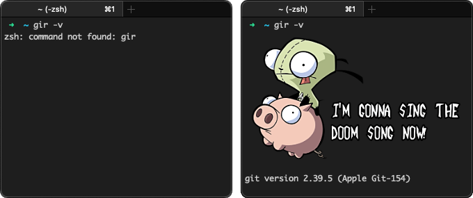

# GIR - for when you mistype `git`

When you use Git all day long, you're bound to slip every once in a while and type `gir` by mistake, resulting in a devastating `command not found` error.

This project comes to the rescue with the "missing" command, which corrects your mistake and invokes the real Git command--after presenting [a reassuring message](https://youtu.be/Nw_cdqQHGA8) from everybody's favorite Invader Zim[^1] sidekick, the appropriately named [GIR](https://zim.fandom.com/wiki/GIR).

Be honest: Which would you rather see in your hour of need?



## Requirements

This command only works with [iTerm2](https://iterm2.com/) on macOS.

## Installation

The command is provided as [a simple bash script](gir). Just [download it](https://raw.githubusercontent.com/TravisCarden/gir/refs/heads/main/gir), make it executable, and put it somewhere in your `$PATH`.

For example:

```shell
curl -o /usr/local/bin/gir https://raw.githubusercontent.com/TravisCarden/gir/refs/heads/main/gir && \
chmod +x /usr/local/bin/gir
```

Note: You may need to use sudo if you don’t have write permissions for `/usr/local/bin`:

```shell
sudo curl -o /usr/local/bin/gir https://raw.githubusercontent.com/TravisCarden/gir/refs/heads/main/gir && \
sudo chmod +x /usr/local/bin/gir
```

[^1]: I'm not necessarily recommending the show. It's a bit... "off". Still, it's hard not to love GIR a little.
